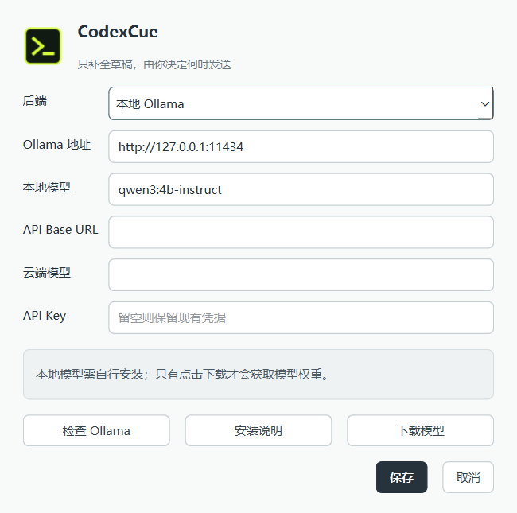

# CodexCue

**Autocomplete for messages you write in Codex.** This small Windows app watches the focused composer in Codex Desktop or the Codex VS Code panel, reads a short slice of the current conversation, and suggests text to append to your draft. Press **Tab** to insert a suggestion. It never sends a message for you.

Rough revision requests are expanded into a short paragraph of relevant details:
what to inspect or improve, constraints to preserve, and how to check the result.
For example, “这个表格的展示方式不太好” can continue with requests to check column
alignment, legibility, spacing, and whether important fields remain easy to find.
Incomplete phrases with too little context still receive a short continuation.
Greetings and openers such as “我希望你” wait for more input instead of borrowing
a task from the conversation. A suggestion that substantially copies the draft,
background, or writing instructions is retried once using the draft alone; edits
cancel this retry too. Only the resulting new text can appear in the popup.

The default backend is a local Ollama model. An OpenAI-compatible API is optional. This is an independent, unofficial companion; it does not use the Codex API or your Codex model quota.



The app uses a quiet, light interface with a compact suggestion beside the composer. Its app and tray icon use the Signal terminal mark.

## Features

- **Conversation-aware completion.** Uses recent user messages and final assistant replies from the current Codex task, plus your unfinished draft.
- **One-keystroke acceptance.** Tab appends the visible suggestion only when the Codex composer still has focus. Otherwise Tab keeps its normal behavior.
- **Automatic task switching.** Recognizes a focused composer at startup and rechecks when you click it or resume typing. An exact, unique title from Codex's local task index can identify short titles and older tasks; message matching is the fallback. Fast task switches defer recognition instead of dropping it. By default, an unidentified or new task uses the draft alone, with a visible label. Strict conversation matching and always using the draft alone are also available in Settings.
- **Local by default.** Runs `qwen3:4b-instruct` through Ollama on `127.0.0.1`. You can instead configure your own OpenAI-compatible service.
- **Quiet while you type.** Blank drafts produce no suggestion. A new edit invalidates old output; suggestions appear after a short pause and do not change word by word.
- **Chinese input friendly.** Suggestions and Tab acceptance pause while an IME composition or candidate window is active, then resume after the committed draft settles.
- **Display-language aware.** Settings, tray status, and notifications use Chinese on Chinese Windows display languages and English otherwise. Restart the app after changing the Windows display language.

## Quick start

For a prebuilt Beta, use the versioned Windows ZIP from the repository's Releases
page and follow [Windows installation, upgrade and removal](docs/WINDOWS.md).
The repository and draft releases may be private until public release is approved.
The source installer below also provisions Ollama and the model.

**Requirements:** Windows 10/11 x64, Codex Desktop or the Codex VS Code extension, internet access for the first install, and several GB of free disk space. An RTX 4090 or similar GPU is recommended, but other hardware can be used with different latency.

Clone this repository, open PowerShell in its root directory, and run:

```powershell
powershell -NoProfile -ExecutionPolicy Bypass -File .\scripts\setup.ps1 -Start
```

The script installs `uv` into `.local\bin\` if needed, provisions Python 3.12 and locked project dependencies, downloads and verifies the official Ollama Windows archive, pulls the roughly 2.5 GB model, checks that Ollama is ready, and starts the companion. The Ollama archive is roughly 1.5 GB. No administrator access or preinstalled Python is required. Running this command explicitly starts those downloads; the app does not download model weights in the background.

The installation is resumable: rerun the same command if a download fails. Files created by the installer and local model weights are ignored by Git.

### Choose a local model

The setup command installs `qwen3:4b-instruct` by default. To start with a different model, pass its Ollama name:

```powershell
powershell -NoProfile -ExecutionPolicy Bypass -File .\scripts\setup.ps1 -OllamaModel qwen3:1.7b -Start
```

| Preset | Tradeoff |
| --- | --- |
| `qwen3:1.7b` | Smaller download and lower memory use; completion quality may be less consistent. |
| `qwen3:4b-instruct` | Default; currently tested on the project's RTX 4090. |
| `qwen3:8b` | Larger model that may improve some suggestions; needs more memory and may be slower. |

Open **Settings** from the tray to switch models. **Refresh model list** shows locally installed models; **Download model** installs the selected one only when clicked. The model field also accepts any Ollama model name. Settings checks that the selected model is installed before saving. Other model families use Ollama's chat template, so their ability to return a relevant continuation varies. Selecting a model does not download it automatically. Download size and speed depend on the chosen model and quantization.

### Let Codex set it up

If you have Codex running on the target Windows machine, give it this repository URL and this request:

> Clone this repository, read `AGENTS.md`, run the Windows setup script with `-Start`, and verify the Python environment, Ollama service, model, and app process. If setup fails, report the failing step and exact error.

[AGENTS.md](AGENTS.md) contains the installation and verification checklist for coding agents.

## Use it

1. Start Codex Desktop or open the Codex panel in VS Code, then start CodexCue. Launching it directly opens Settings; its icon remains in the Windows system tray. Click the tray icon to open Settings, or right-click it for the status menu. If you installed without `-Start`, run `.\.venv\Scripts\codexcue.exe`.
2. Click the composer in the Codex task you want to continue and begin typing. The tray menu shows a short preview of the automatically identified conversation.
3. When a suggestion appears beside the composer, press **Tab** to append the full suggestion. Keep editing or send the message yourself when ready.

The companion reads the draft after about 300 ms without typing and checks the matched task log about every 400 ms. A known editor that briefly reports its pre-edit text gets up to two additional reads, 80 ms apart. Newly recorded user messages and final assistant replies enter the next suggestion; an assistant reply still in progress is not used. You do not need to add punctuation to trigger a suggestion. The first request may show a model-loading state. A blank composer never requests a suggestion.

The model receives the history as quoted background and continues a short, unchanged tail of the draft in a structured response. The app validates that tail and extracts only the new suffix. Ollama constrains the original tail during decoding; this preserves spaces, partial words and numbers without rewriting the draft. The popup displays the full text that Tab will insert. There is no confidence-score threshold that hides suggestions. Completed questions ending in `?` or `？` are not extended into answers. Stale input and IME composition still prevent display. In strict mode an unidentified conversation also prevents display; automatic mode uses an empty history instead.

Network requests are cancellable while waiting for headers or a streaming chunk, with an eight-second total completion deadline. The local model expires after 60 seconds idle by default, configurable from 0 to 3,600 seconds in Settings; 0 releases after each request. Pause and normal exit also request model release. A cold model may make the next suggestion slower. The request, popup and Tab paths share one editor-snapshot eligibility check.

If Windows UI Automation cannot read the draft, focus the Codex composer and press **Ctrl+Alt+D** to explicitly copy the draft and request a suggestion. This fallback temporarily uses the clipboard and only guarantees restoration of plain text. Its popup is placed inside the screen, including when the host is maximized. Tab insertion also temporarily uses the clipboard, restoring common formats after a short delay.

## Configuration

| Goal | What to do |
| --- | --- |
| Use the default local model | Run the Quick start command. Open **Settings** from the tray to change the Ollama address or model name. |
| Install another local model | Add `-OllamaModel MODEL:TAG` to setup, or select a model in Settings and click **Download model**. |
| Use an HTTP proxy for downloads | Add `-ProxyUrl 'http://127.0.0.1:PORT'` to the setup command. Local Ollama requests bypass the proxy. |
| Use a hosted model | Run `powershell -NoProfile -ExecutionPolicy Bypass -File .\scripts\setup.ps1 -AppOnly -Start`, then select **OpenAI-compatible API** in Settings. |
| Defer the local model download | Add `-SkipModel` to setup. Install the model before using local completion. |
| Build a Windows executable | Exit any running packaged copy, then run setup with `-Build -SkipModel`. The result is in `dist\CodexCue\`. |

For a hosted backend, enter the **API Base URL** (for example, `https://provider.example/v1`, without `/chat/completions`), model name, and API key. Remote services must use HTTPS. The API key is stored in Windows Credential Manager, not in the app configuration file. The conversation excerpt and draft will be sent to the service you choose.

## Privacy and limitations

- The local backend only connects to loopback Ollama. The repository contains no model weights, API keys, personal configuration, or conversation logs.
- The context reader takes recent real user messages and final assistant replies. It skips system, developer, tool, and assistant analysis records; recognized runtime wrappers and image path placeholders are removed. Image contents are not sent to the completion model.
- Context is capped at roughly six messages and 1,200 characters. Long turns are truncated to keep requests small.
- Diagnostic logs record state, timings, and message counts, but not draft text, conversation text, raw model output, or API keys. `request_gate` records why a request is waiting, and `completion_output` distinguishes an empty suffix from a malformed response or an echoed draft. Open the log folder from the tray menu.
- Codex Desktop can change its Windows accessibility tree. Such changes may require an adapter update. Task matching refuses ambiguous matches; automatic mode can still suggest from the draft without importing any unverified history.
- VS Code support is experimental. On this machine, extension `openai.chatgpt-26.917.62051` exposed a focused ProseMirror composer through Windows UI Automation; the adapter read its blank state and matched the visible conversation to one local session. A hands-on check confirmed that a suggestion appeared and Tab appended it without sending. End-to-end latency has not been measured across many VS Code drafts, and a future extension update may change its accessibility tree.
- Warm real-model acceptance measures input-to-popup time in a synthetic desktop window. This is not a latency guarantee for the actual Codex host or for cold models. `scripts/benchmark.py` measures only the narrower backend path; natural-usage timing is available through `scripts/report_metrics.py`.

## Troubleshooting

- **No tray icon:** Run `.\.venv\Scripts\codexcue.exe` from PowerShell to see startup errors. On first launch, complete the Settings dialog.
- **Settings and suggestions invisible after a scripted restart:** CodexCue now normalizes Windows `SW_HIDE` before Qt starts. Use `--background` to start in the tray; later settings and suggestions remain visible. A hidden launcher briefly hands off to a fresh process, so its initial PID is not the long-running app PID.
- **No suggestion:** Check that the app is enabled, the focused Codex composer contains an unfinished draft, and the model is available. Strict context mode additionally requires an identified conversation with history.
- **Wrong or missing task:** Recognition starts on a focused composer and retries after typing or clicking. Duplicate task titles deliberately remain unresolved when no unique identity is available. Use **Open diagnostic log folder** to inspect state and timing without exposing conversation text.
- **Download fails:** Retry with the proxy option above if your network requires one. The setup script reports the failed step.

## Development

```powershell
powershell -NoProfile -ExecutionPolicy Bypass -File .\scripts\verify.ps1
# Exercise the exact packaged executable in three fresh processes:
powershell -NoProfile -ExecutionPolicy Bypass -File .\scripts\verify.ps1 -PackagedExe .\dist\CodexCue\CodexCue.exe
# Add real-model latency, paste and unload checks without downloading anything:
powershell -NoProfile -ExecutionPolicy Bypass -File .\scripts\verify.ps1 -PackagedExe .\dist\CodexCue\CodexCue.exe -LiveModel qwen3:4b-instruct
.\.venv\Scripts\python.exe scripts\benchmark.py --help
.\.venv\Scripts\python.exe scripts\check_completion_quality.py --output .local\completion-quality.json
# Real installed model, synthetic desktop, native paste and model-release checks:
.\.venv\Scripts\python.exe -m codex_companion --self-test --live-model qwen3:4b-instruct --output .local\live-model-new-run
# Numeric metrics from natural usage; does not export conversation contents:
.\.venv\Scripts\python.exe scripts\report_metrics.py .local\logs\companion.log --output .local\runtime-metrics.json
```

`verify.ps1` runs regression tests, checks package libraries when an EXE is selected, and repeats desktop acceptance three times (`-Repeat` changes the count). It requires an unlocked interactive Windows desktop and briefly opens its own synthetic window. No typing, clicking, model download, or real conversation is needed. Results go to a new `.local\verify-*\` directory, or a fresh directory passed with `-Output`; a failed stage returns a nonzero exit code.

It also repeats the normal tray lifecycle with an isolated instance name and disabled completion. These processes are deliberately launched with `-WindowStyle Hidden`: checks cover background/direct startup, cross-process settings activation, reopening settings, dropdowns, and suggestion visibility without stealing focus. Visibility is checked with Windows `IsWindowVisible`, not just Qt's internal state. Every round exits before the next restart; finite test launchers propagate the real child's exit code.

Each desktop run creates an isolated synthetic Codex home and a loopback model server. It exercises the real UI Automation reader, resolver, worker threads, HTTP streaming, popup, Tab-hook decision, native clipboard paste, and clipboard restoration. Cases include cold start, short titles, switching without old context, strict rejection of duplicate titles, draft-only recovery, late responses after Enter, a stalled HTTP request, and maximized fallback placement. The fallback clipboard read is substituted because the fixture shares the test's Qt thread. `receipt.json` records the checks, coverage boundaries and executable hash. Failures also save the synthetic window screenshot and state; no private Codex logs are copied.

The synthetic host substitutes only host identity and generates its own draft/input events. These receipts do not certify the current Codex accessibility tree, physical keyboard delivery, real Chinese IME behavior, or model semantics. Unit tests separately cover adapter identity rules and IME guards. This distinction keeps deterministic acceptance useful without mistaking a mock model's correct output for completion quality.

The quality check uses only synthetic messages against an already installed local model and records protocol errors instead of losing the report on the first failure. Its pairs can be reviewed by the coding agent for repetition, answer-like output, grammar and unsupported specificity. `--live-model` measures input-to-popup latency in the synthetic desktop and verifies idle/explicit unloading through Ollama's resident-model API. Neither certifies arbitrary future model outputs. Runtime metrics separately measure natural Tab acceptance, UIA time, input-to-popup latency, request failures and UI stalls; missing samples and semantic error rates remain unknown rather than being reported as zero.

Windows CI exercises the `uv` bootstrap, managed Python, simulated conversations and model interfaces, and a packaged build. Run desktop acceptance on an interactive Windows session before replacing the installed EXE; headless CI is not a substitute for this layer.

Release maintenance is documented in [RELEASING.md](docs/RELEASING.md). The build
includes project/dependency licenses, exact Qt source archives, checksums and
source commit metadata. Install/upgrade/uninstall and download recovery have
offline tests; CI also exercises maintenance against the actual packaged tree.

## License

[MIT](LICENSE). This project is not affiliated with OpenAI.
