# CodexCue

CodexCue helps you write your next message to Codex. Start typing, pause for a moment, and a suggestion appears beside the input box. If it fits, press **Tab** to add it to your draft.

Sometimes you just need to finish a sentence. Other times, you've got a rough idea like “this table feels cramped” and want help spelling out what should change.



## What it does

- Suggests a few words or a more detailed follow-up, depending on what you're writing.
- Draws on recent messages when it can identify your current Codex task. Otherwise, it uses your draft alone.
- Updates suggestions as you keep typing. You can edit anything you accept, and you still send the message yourself.
- Runs the AI model on your own PC through [Ollama](https://ollama.com). No API key is needed for suggestions.

## When it helps

You don't need a polished request to get started:

| You start with… | It might help you add… |
| --- | --- |
| “I think we should…” | A possible next thought, based on the conversation. |
| “This table feels cramped.” | A request for clearer spacing, aligned headings, and readable text in a smaller window. |
| “The login flow is confusing.” | Which steps to simplify and where people need clearer feedback. |
| “It's hard to tell if the export worked.” | What a successful export should contain and how missing items should be shown. |

The table and illustration are examples. Suggestions will vary. If a guess misses the mark, just keep typing.

## What you'll need

- **Windows 10 or 11 on an Intel or AMD 64-bit PC.**
- **Codex Desktop**, installed and ready to use. The Codex panel in VS Code has experimental support.
- **Internet access for setup** and several GB of free disk space. Expect about 1.5 GB of downloads for Ollama and 2.5 GB for the default model, plus app files. Leave room to unpack them.

Codex handles the setup; no separate Python or Ollama installation is needed. You don't need administrator rights. Suggestion speed depends on your computer and model.

## Get started

Paste this into Codex:

```text
Install and set up CodexCue on this Windows PC: https://github.com/PPPGLL/CodexCue
Follow the setup instructions in AGENTS.md, check that the local model is ready, and start the app.
```

The default model is `qwen3:4b-instruct`. You can choose another in Settings later.

Once it's running, try typing in a Codex conversation. Click the CodexCue icon near the Windows clock for Settings, or right-click it to pause suggestions or **Release model**. The icon may be under the **^** arrow.

## Common questions

### Nothing shows up. What should I check?

Right-click the tray icon to check that suggestions are enabled and the model is ready. Click inside the Codex message box. If typing still isn't being picked up, press **Ctrl+Alt+D**. This reads your draft through the clipboard and requests a suggestion.

An empty input box won't trigger a suggestion. A finished question also won't be continued with an answer.

### Why is the first suggestion slow?

The model needs to load once when CodexCue starts. It stays loaded between requests, even when suggestions are paused. To free up memory, right-click the tray icon and choose **Release model**. It will load again when you next type. Quitting CodexCue also releases it.

If it still feels slow, try downloading and selecting `qwen3:1.7b` in Settings. It's smaller, though its suggestions may be less useful.

### The suggestion isn't what I meant.

Keep typing to give it more direction, or ignore it. You can also edit the text after pressing Tab.

### Setup couldn't finish downloading.

Check your connection, then ask Codex to retry and share the error message with it. If your network needs a proxy, give Codex that address too.

### Does it send my drafts anywhere?

Your drafts and the conversation snippets CodexCue uses stay on your PC. Codex itself has its own data settings. CodexCue only needs the internet to download the software and models it runs.

### Where can I find error details?

Right-click the tray icon to open the logs folder. Logs record status and timings without draft or conversation text. If you report a problem, include your Windows and Codex versions, the model name, and what happened.
